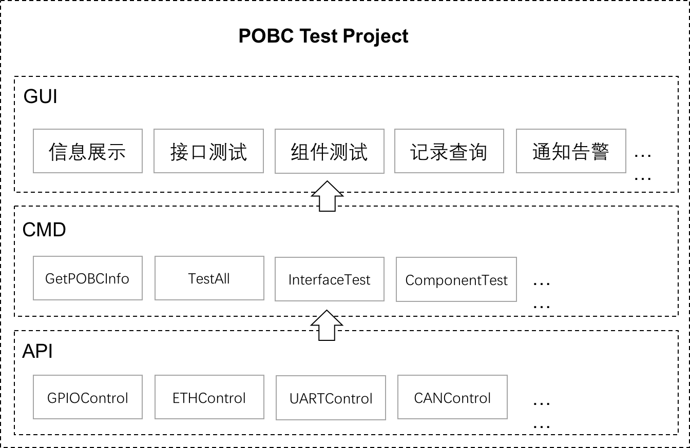

# POBC automated test project

## Description

A POBC automated test based on Raspberry pie

Architecture


## What we have

* A command line for automated test control.
* A web service for automated test control.
* A general python API for Raspberry pie control.

## How to use it

* Download pobc_auto_test.bin
* chmod +x pobc_auto_test.bin
* ./pobc_auto_test.bin
* access url from web browser like ```http://192.168.1.10:8010```
* set test params and start test